# 校园活动板 · Campus Board

面向在校学生、重点照顾新生体验的**校园活动与机会平台**。

> 本作品为珠海科技学院计算机协会软件部 2026 年秋季纳新第二轮考核（AI Agent 产品实战）题目实现。
> 题目提供的 26 条模拟校园信息全部落地于 `data/activities.json`，**未编造任何题目未给出的事实**；
> 所有状态由基准日期实时计算，数据中不存在写死的"已截止"文案。

**在线访问**：**https://link693.github.io/campus-board/**
**仓库地址**：https://github.com/link693/campus-board
**本地运行**：直接双击 `index.html`（零构建、零依赖，无需服务器）

---

## 一、解决的问题

校园活动信息散落在学校、学院、学生个人等不同来源，质量与完整度参差不齐。学生（尤其是新生）真正困难的地方不是"看不到信息"，而是：

1. **同一件事有多条通知**——后一条修订了前一条的时间、地点或名额，按旧信息行动就会白跑；
2. **看不出还来不来得及**——报名截止已经过去、直播已经结束，列表里却毫无标记；
3. **关键信息缺失却没有任何提示**——费用、地点、截止时间没有给出，学生只能凭感觉判断；
4. **学生自发信息真假难辨**——"零门槛、日结、加私人微信"与正常约球招募混在一起；
5. **新生不知道哪些跟自己有关**——年级限制、是否需要基础、是否需要设备，都要点进去逐条读。

## 二、核心功能

| 功能 | 说明 |
| --- | --- |
| 智能发现流 | 按「别错过 / 还能报名 / 长期招募 / 无需报名 / 已截止」分桶展示，同屏给出状态、截止倒计时、地点、名额 |
| **日历视图** | 月历网格把活动摊到每一天：今天描边高亮、冲突日打橙色角标，点日期展开当天明细。月度统计直接给出「22 个节点 · 8 天有事 · 3 天冲突」 |
| **繁忙度密度条** | 未来 14 天一格一天，颜色深浅代表当天事务量，不点开任何东西就能看出哪几天最挤；点格子跳到日历 |
| 重复通知合并 | 同一事项的多条通知合并为一条，**保留完整变更记录**（原文 → 现在），并提示"已报名者无需重复提交"这类动作指引 |
| 实时状态判定 | 是否已结束、是否已截止、还剩几天，全部由基准日期计算得出，改日期即整体重算 |
| 缺失信息显式呈现 | 题目没给的字段统一显示"未提供"，并列出缺失清单，**不用推测值填充** |
| 开放发布与秩序治理 | 学生可自主发布约球、搭子、组队信息，直接进入正常使用流程；发布前实时给出风险提示，可编辑与撤回 |
| 本地持久化 | 收藏、报名标记、我的发布、筛选偏好刷新或重开都保留 |
| 个人时间线 | 把报名截止、活动开始、作品提交排成时间轴与倒计时，解决"信息分在 26 条里"的问题 |
| **时间机器** | 把"今天"改成任意日期，**所有状态判定实时重算**，并预告未来几天哪条会截止、哪天会开始、哪份资料会失效 |
| **精力预算** | 材料里 03/08/13 分别要求每周投入 4/5/6 小时，平台把它加起来：告诉你当前标记参加的机会共需几小时、是否超出你的预算、哪几项组合刚好塞得下 |
| **撞车检测** | 自动发现同一时段的重叠活动（9/21 晚间有多场活动时间重叠），详情页直接提示需要二选一 |
| 时效预警 | 识别"提取信息有效至 9 月 22 日"这类时效陷阱，临近失效时在卡片与详情双重提醒 |
| 日历导出 | 一键导出 `.ics`，双击导入手机日历；报名截止会生成**提前一天**的提醒 |
| 新生模式 | 选"大一"即自动过滤年级不适用的机会（如仅限大二及以上的科研助理） |
| 来源分层 | 学校 / 学院 / 校内组织 / 学生自发四类来源全程可见，来源决定可信度的起点 |
| 深链分享 | 支持 `index.html#活动id` 直接打开某条详情 |

## 三、运行方式

**方式一：直接打开**

```text
双击 index.html
```

零构建、零依赖、无需 Node 或 Python，`file://` 协议下即可完整使用（数据以 `js/data.js` 形式内联，规避浏览器对本地 `fetch` 的限制）。

**方式二：本地静态服务器**（可选）

```powershell
python tools/serve.py                          # http://127.0.0.1:8080
python tools/serve.py --prefix campus-board    # 模拟 GitHub Pages 的子路径发布形态
```

或使用任意静态服务器（`python -m http.server 8080`、`npx serve .` 均可）。

**方式三：GitHub Pages**

已通过 `Deploy from a branch`（`main` / root）发布，因为本项目是零构建静态站点，此方式与 Actions 发布等价且少一个失败点。

仓库内同时保留了 `.github/workflows/pages.yml`（先跑测试与数据校验、通过后才发布）。若希望改用该流程，把仓库 **Settings → Pages → Source** 改成 `GitHub Actions` 即可，无需改动任何代码。

## 三之二、界面效果

以下均为浏览器真实渲染截图（非设计稿），可用于评分时快速了解交互与排版：

| 发现流（桌面端） | 通知变更追踪 |
| --- | --- |
| 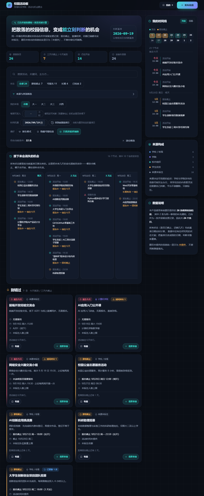 | 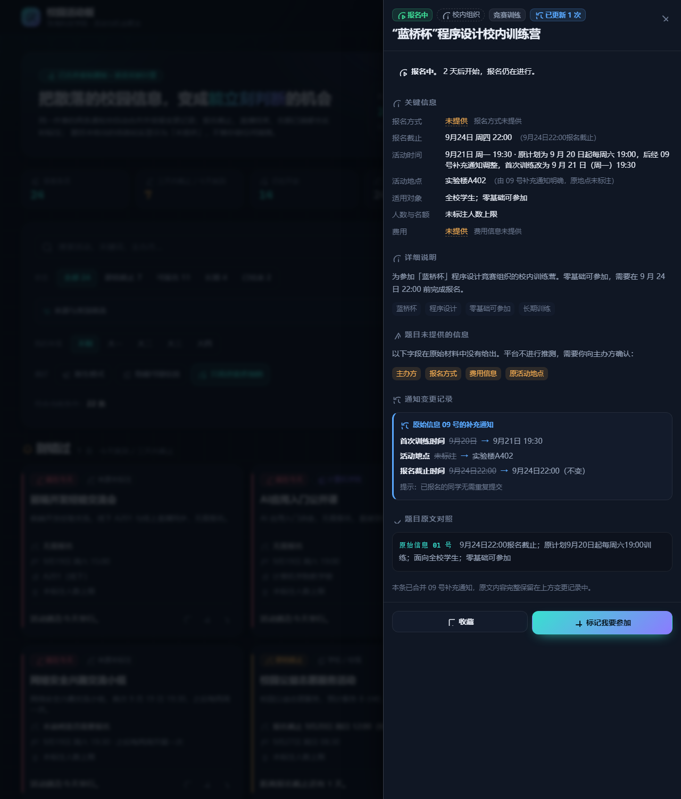 |

| 可疑内容标注 | 学生自主发布 |
| --- | --- |
| 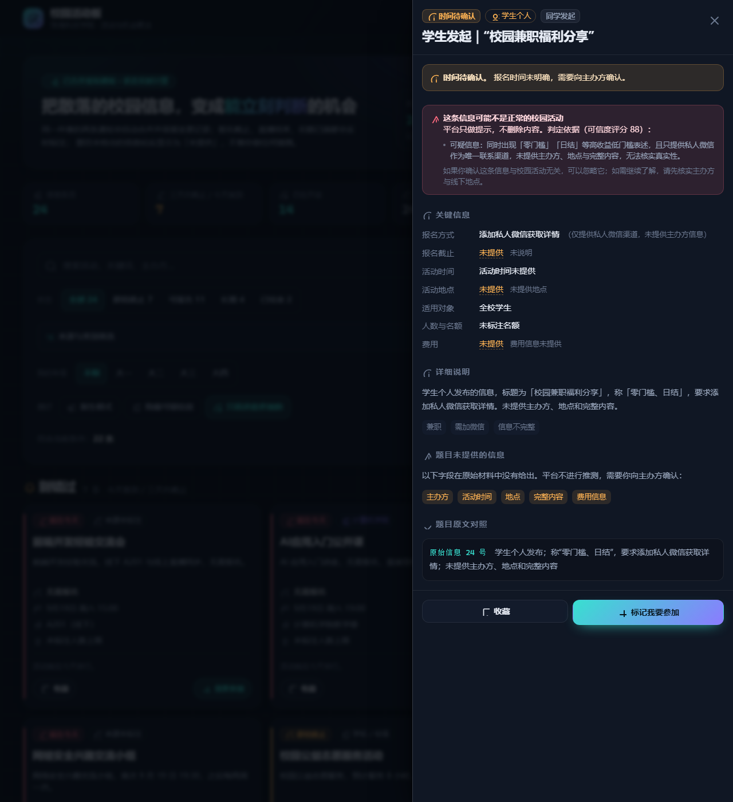 | 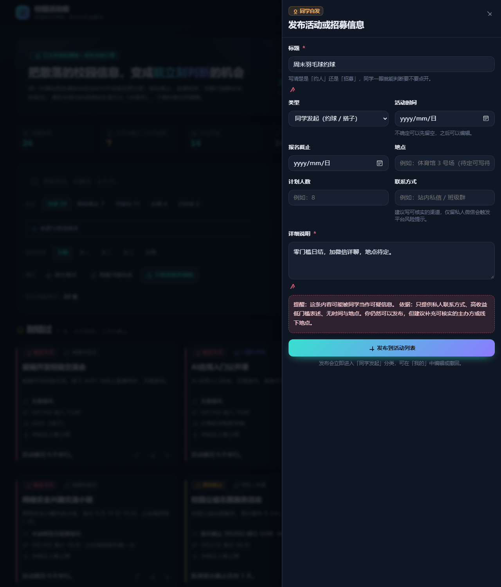 |

卡片操作按钮的默认态与选中态（36px 高、带描边与底色，选中后填充主色，避免在深色卡片上"看不出可点"）：

| 默认态 | 选中态 |
| --- | --- |
| 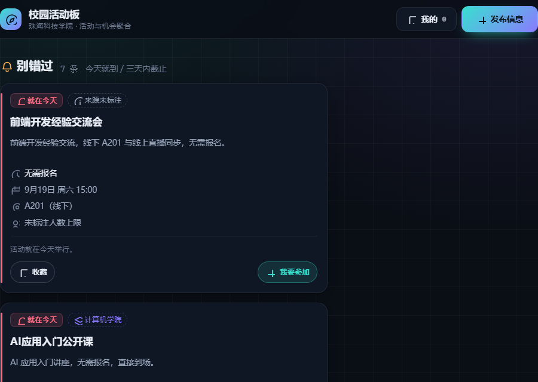 | 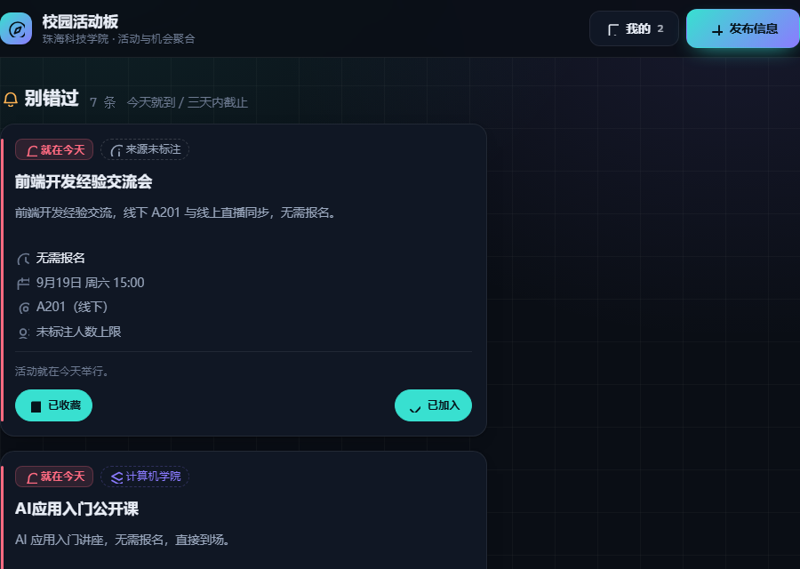 |

| 精力预算（超支时给出可行组合） | 时间机器（改写基准日，全部重算） |
| --- | --- |
| 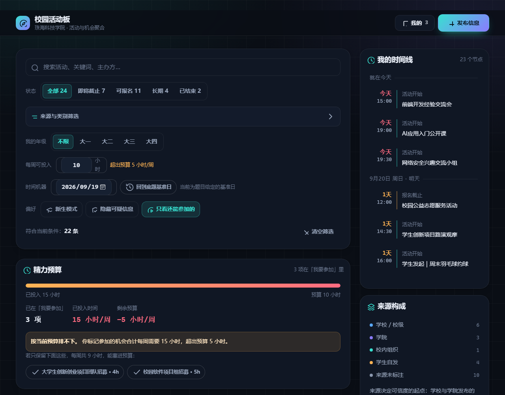 | 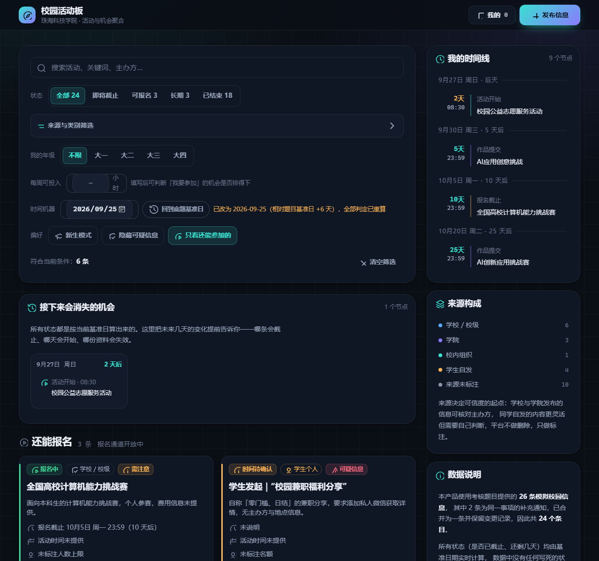 |

日历视图与繁忙度密度条（月度统计与冲突日直接可见）：

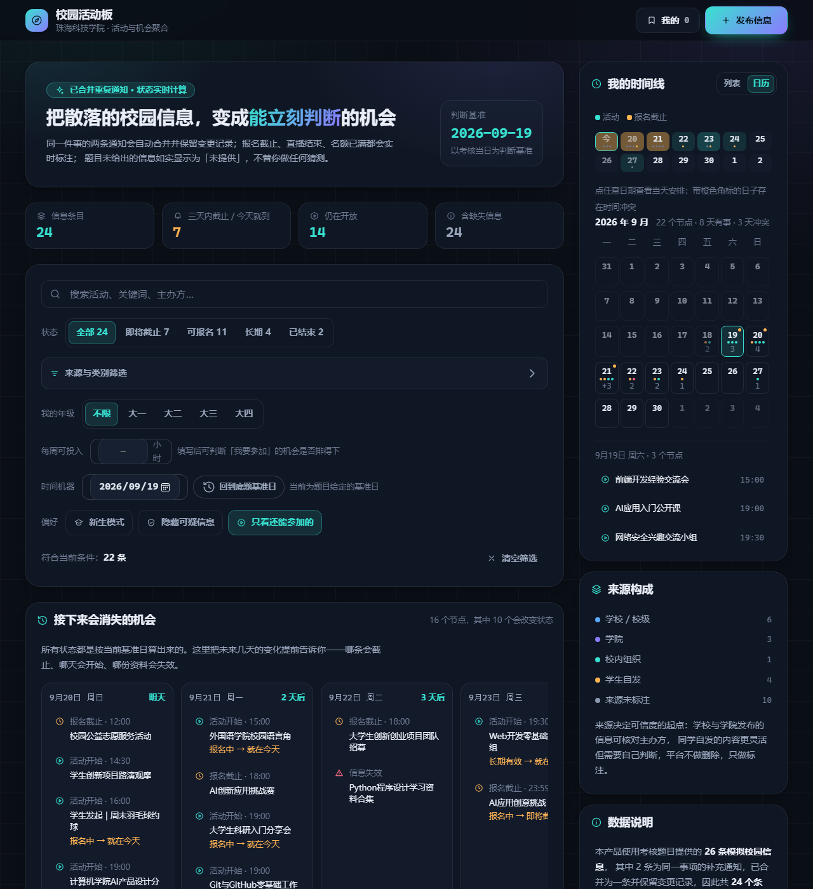

撞车检测（详情页列出重叠时段与其他机会）：

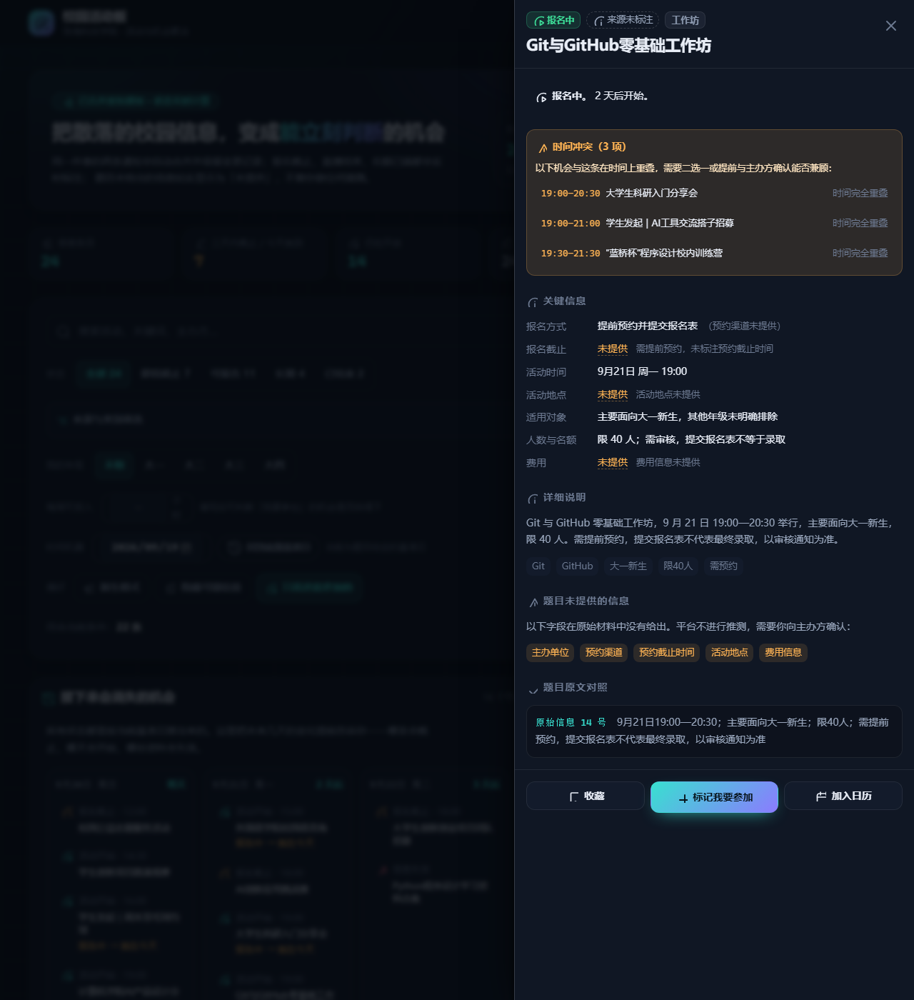

移动端（390px，已验证无水平溢出）：

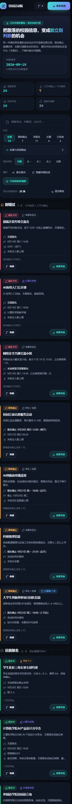

## 四、自主设计的实用或创新功能

题目要求"至少自主设计并实现 1 项"。本作品实现了 7 项，均直接对应题目材料中真实存在的问题。

### 创新点一：时间机器 —— 让"状态是算出来的"变成可以亲手验证的事实

这是本作品最核心的创新。材料是一组**某个时间点的快照**：报名截止、直播已结束、名额已满、提取码有时效——这些状态**只在 9 月 19 日这一天成立**。同类作品几乎都会把它们写死成文案。

平台在筛选区提供一个日期选择器。把"今天"改成 9 月 25 日，整块信息板会重新计算：

- 9 月 21 日的训练营首训从"报名中"变成"已结束"；
- 9 月 22 日截止的创新创业招募从"即将截止"变成"报名已截止"；
- Python 资料的提取信息（有效至 9 月 22 日）从未失效变成**已失效**。

同时，"接下来会消失的机会"面板会预告未来 7 天的节点，并标出哪些节点会**真正改变状态**（如"报名中 → 就在今天"）。这既证明了状态不是写死的，也解决了真实需求——**提前规划"我下周该处理什么"**。

### 创新点二：精力预算 —— 从"找活动"升级到"排得下"

材料里三条信息写明了每周时间投入要求：创新创业团队"每周需稳定投入 4 小时以上"、校园软件项目组"每周预计投入 5 小时"、科研助理"每周预计投入 6 小时"。**没有任何产品会把这些数字加起来**，但这恰恰是学生真正会踩的坑：都报了，然后都做不完。

学生填入"我每周能投入 10 小时"，平台就会核算：当前标记参加的三项合计 15 小时，**超出 5 小时**；若只保留 4 小时与 5 小时这两项，共 9 小时，能塞进预算——并直接给出这两项的跳转入口。

### 创新点三：撞车检测 —— 列表形式完全看不出来的问题

材料按条目罗列，时间冲突被完全掩盖。平台解析每场活动的起止时间后可以发现：

- **9 月 21 日 19:00—19:30 这一时段挤了四场活动**：程序设计训练营首次训练（19:30）、大学生科研入门分享会（19:00）、Git 与 GitHub 工作坊（19:00）、学生发起的 AI 工具交流搭子（19:00）；
- AI 应用入门公开课（19:00—20:30）与网络安全兴趣交流小组（19:30—21:30）重叠 60 分钟；
- 9 月 20 日学生发起的羽毛球约球（16:00—18:00）与学生创新项目路演观摩（14:30—16:30）重叠。

详情页会列出全部冲突项与重叠时段，并明确提示"需要二选一或提前与主办方确认能否兼顾"。

### 创新点四：通知变更追踪

题目故意给出"同一活动两条通知"，且第二条修订了第一条。平台不丢任何一条，而是合并为一条并以"原文 → 现在"的形式呈现变更，同时保留原通知的动作指引。学生看到的是**当前有效的信息**，而不是两条互相矛盾的旧信息。

### 其余三项

**可信度评分与可疑内容标注**：不是简单屏蔽，而是给出可解释的评分与理由（人工复核标记 + 运行时特征检测）。**平台只提示，不删除、不替用户做决定。**

**新生模式与年级适配**：选择年级后自动排除不适用的机会，并说明原因（如"该机会要求大二及以上"）。

**个人时间线与倒计时**：把分散在 24 个条目里的报名截止、活动开始、作品提交统一排成时间线，标注剩余天数与紧急程度。

## 五、我在题目材料或产品设计中主动发现并处理的关键问题

**最关键的一项：信息 01 与 09 之间存在的"时间倒挂"，以及伴随而来的信息缺失。**

题目给出 01 号信息：训练营"9 月 24 日 22:00 报名截止；原计划 9 月 20 日起每周六 19:00 训练"。随后 09 号补充通知："因场地调整，首次训练改为 9 月 21 日 19:30，地点改至实验楼 A402；已报名同学无需重复提交；报名截止时间不变。"

逐条核对后可以发现两个真实问题：

1. **首次训练（9 月 21 日 19:30）发生在报名截止（9 月 24 日 22:00）之前。** 这意味着学生可以在训练开始之后、报名截止之前继续报名——按常规"报名截止早于活动开始"的直觉理解会得出错误结论。平台没有替学生"修正"这个矛盾，而是在条目上标注了「报名截止晚于首次训练」的提醒，并把两个时间点同时呈现，让学生自己判断。

2. **01 号信息本身没有任何地点，09 号才给出地点。** 如果只做简单的"取最新一条"，就会丢掉"原地点未标注"这个事实；如果只做条目罗列，学生需要自己在两条信息之间做交叉比对。平台的变更记录同时保留"未标注 → 实验楼 A402"，并明确写出该地点的来源。

同时处理的其他关键问题：

| 问题 | 材料出处 | 处理方式 |
| --- | --- | --- |
| 直播已结束、报名已截止、可候补入场 | 04、05、19 | 状态判定为"已结束 / 报名已截止"，并在 19 号条目上保留"现场有余位可候补入场"的出路，而不是简单标记为不可用 |
| 有截止规则却没有日期 | 06、08、16 | 判定为"长期有效"，显示"满员即止，建议尽早联系"，**不臆造一个截止日期** |
| 名额变化 | 03、20 | 合并后明确标注"开发方向名额已满"，只推荐仍在招募的设计与材料方向 |
| 费用未知、地点未定、提取信息有时效 | 12、23、17 | 分别标注"费用需向主办方确认""地点未确定""提取信息 9 月 22 日后失效" |
| 标题与内容不符的推广 | 25 | 识别为可疑信息并说明理由：标题为技术交流，正文实为商家优惠与购买链接 |
| 截止时间只精确到日 | 13 | 按当日 23:59 计算并明确提示"原文只写到日，建议提前提交" |

## 六、数据来源与真实性

- 原始材料：考核题目第四节「校园活动与机会信息」表格，共 **26 条**；
- 其中 **09 是 01 的补充通知、20 是 03 的补充说明**，按同一事项合并，得到 **24 个条目**；
- 两条原始信息都完整保留在 `relatedRefs` 与 `updates` 中，**没有丢弃任何字段**；
- 详情页每条都带「题目原文对照」，可逐字核对，避免"AI 改写"的质疑；
- `tools/build_dataset.py` 会逐字比对 `rawSummary` 与原文，**不一致即构建失败**，从机制上防止编造；
- 校验器同时检查 26 条是否**全部被覆盖**，防止遗漏。

## 七、技术形态

| 层 | 实现 | 说明 |
| --- | --- | --- |
| 前端 | 原生 HTML / CSS / JavaScript | 零构建、零依赖、零框架，静态托管友好，`file://` 可直接运行 |
| 领域逻辑 | `js/logic.js` | 纯函数：状态机、年级适配、可信度评分、分桶、时间线 |
| 状态持久化 | `js/store.js` | 仅用 `localStorage`，不可用时安全降级为内存模式 |
| 离线工具链 | `tools/*.py` | 数据抽取、校验与构建，**不进入运行时**，运行时无任何 Python 依赖 |

**AI 的使用方式**：AI（Coding Agent）参与开发全过程；产品内**不调用**任何在线大模型，数据清洗与结构化以离线方式完成并固化为 `activities.json`。因此作品没有 API Key、没有调用成本、不会因网络或额度失败，也便于评分者直接复现。

```text
.
├─ index.html                 单页入口，双击即可运行
├─ css/tokens.css             设计令牌（字号/间距/圆角/色彩/动效）
├─ css/app.css                组件与布局，只引用令牌
├─ js/data.js                 由 data/activities.json 生成的数据源
├─ js/logic.js                领域逻辑（纯函数，可测试）
├─ js/store.js                本地状态持久化
├─ js/ui.js                   视图渲染
├─ js/main.js                 控制器：筛选、抽屉、发布流程
├─ data/raw_source.txt        题目原文存档（唯一事实来源）
├─ data/activities.json       结构化后的 24 个条目
├─ tools/extract_docx.py      从题目 DOCX 提取原文
├─ tools/build_dataset.py     校验并生成 js/data.js
├─ tools/build_report.py      生成数据治理审计报告
├─ tools/push_to_github.py    建远端并推送（gh 未登录时的替代路径）
├─ tests/*.test.js            74 项自动化测试
├─ docs/DATA_AUDIT.md         数据治理审计报告（自动生成）
└─ docs/DESIGN.md             设计系统说明
```

## 八、验证与测试

```powershell
npm test                       # 一次跑完全部测试（需 Node 18+）
```

或分别运行：

```powershell
node tests/logic.test.js         # 46 项：事实判定、日期计算、筛选排序、可信度、时间线
node tests/features.test.js      # 27 项：撞车检测、精力预算、时效预警、时间机器、日历导出
node tests/store.test.js         # 14 项：持久化、异常降级、数据回读
node tests/dom-wiring.test.js    # 14 项：DOM 接线、图标定义、设计令牌约束、可点尺寸
node tests/status-parity.test.js #  6 项：前端与离线报告的状态判定一致性

python tools/build_dataset.py --check   # 数据校验：结构、关系链、无编造、无遗漏
python tools/build_report.py            # 生成 docs/DATA_AUDIT.md 数据治理审计报告
python tools/stamp_assets.py            # 写入资源版本号，避免改了看不到
```

CI 配置在 `.github/workflows/pages.yml`：推送到 `main` 时先跑全部测试与数据校验，通过后再发布 Pages。
数据校验不需要安装额外依赖（只读取已存档的 `data/raw_source.txt`）。

**为什么要有「状态判定一致性」测试**：前端（`js/logic.js`）与离线报告（`tools/build_report.py`）
各自实现了同一套状态规则。两份实现一旦漂移，就会出现"界面说还能报名、审计报告说已截止"这种
自相矛盾，而人工检查几乎发现不了。该测试在 4 个不同基准日下逐个比对两侧判定，不一致即失败。

测试覆盖的是**题目事实**而非实现细节，例如："04 号直播已结束应判为已结束""19 号报名已截止但给出候补出路""把基准日改到 9 月 28 日时训练营应变为已结束"。若实现改动导致这些事实判定改变，测试会失败。

开发过程中通过测试与浏览器渲染自检发现并修复的真实缺陷（均已补回归用例）：

- **持久化静默失效**：`localStorage` 探测在函数实参求值阶段抛错并被 `catch` 吞掉，导致永远降级为内存模式，用户操作刷新即丢；
- **状态优先级错误**：长期招募与"无需报名"分支抢占了"就在今天"的判定；
- **图标尺寸失控**：全局 `max-width: 100%` 让未声明尺寸的 SVG 撑满容器；
- **`[hidden]` 失效**：组件的 `display: flex` 覆盖了浏览器默认的隐藏行为。

## 九、已知限制

- 数据为题目给定的静态模拟信息，新增内容只保存在本地浏览器，不跨设备同步；
- 基准日期默认取题目要求的 2026-09-19，可通过 `data/activities.json` 的 `meta.baselineDate` 调整并整体重算；
- 可信度评分是**规则 + 人工复核**的启发式判断，只用于提示，不构成对信息真实性的结论；
- 题目未提供的字段一律不推测，因此部分条目信息天然不完整。

## 十、如果继续开发

1. **接入真实来源**：把 `tools/` 的离线流程改为可配置的抓取与审核管道，加入来源可信度与修改留痕；
2. **发布内容的审核与申诉**：对可疑内容的判定给出可申诉入口，避免规则误伤正常的学生招募；
3. **多设备同步与订阅提醒**：报名截止前的提醒推送，是校园场景里最直接的刚需；
4. **重复通知的自动归并**：目前依赖人工复核，可引入标题与时间相似度做候选推荐，但仍保留人工确认。

---

## 附：原始题目信息索引

`data/activities.json` 中每个条目都带有 `sourceRef`（对应题目表格编号）与 `relatedRefs`（合并的补充通知编号），便于逐条回溯：

| 题目编号 | 条目 id | 说明 |
| --- | --- | --- |
| 01 + 09 | `lanqiao-training-camp` | 训练营，含时间与地点变更 |
| 02 | `ai-intro-open-class` | AI 应用入门公开课 |
| 03 + 20 | `innovation-team-recruit` | 创新创业团队招募，开发方向已满 |
| 04 | `math-modeling-replay` | 数学建模分享会，直播已结束 |
| 05 | `public-service-volunteer` | 公益志愿服务 |
| 06 | `web-dev-study-group` | Web 开发学习小组，满员即止 |
| 07 | `ai-innovation-challenge` | AI 创新应用挑战赛 |
| 08 | `campus-software-team` | 校园软件项目组，长期招募 |
| 10 | `frontend-exchange` | 前端开发经验交流会 |
| 11 | `research-intro-talk` | 科研入门分享会 |
| 12 | `computer-ability-challenge` | 计算机能力挑战赛，费用未知 |
| 13 | `research-assistant` | 科研助理，限大二及以上 |
| 14 | `git-github-workshop` | Git 与 GitHub 工作坊，需审核 |
| 15 | `ai-creative-challenge` | AI 应用创意挑战 |
| 16 | `campus-photography-volunteer` | 摄影志愿者，长期招募 |
| 17 | `python-materials` | Python 资料合集，提取信息有时效 |
| 18 | `cybersecurity-group` | 网络安全兴趣小组 |
| 19 | `innovation-roadshow` | 创新项目路演，可候补入场 |
| 21 | `college-ai-sharing` | 计算机学院 AI 产品设计分享会 |
| 22 | `badminton-meetup` | 学生发起：羽毛球约球 |
| 23 | `ai-tool-buddy` | 学生发起：AI 工具交流搭子 |
| 24 | `campus-part-time-benefits` | 学生发起：兼职福利分享（可疑） |
| 25 | `digital-gadget-ad` | 学生发起：数码新品体验交流（可疑推广） |
| 26 | `language-corner` | 外国语学院校园语言角 |
